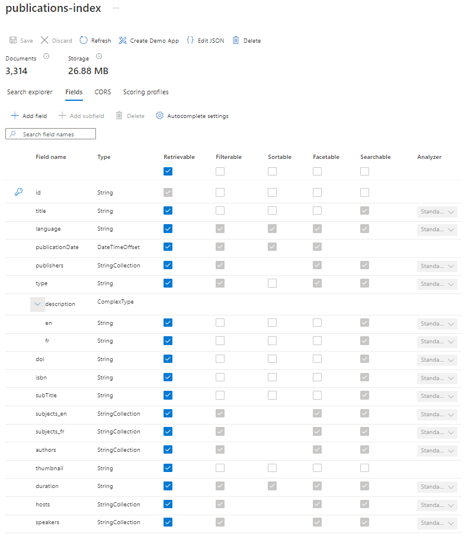

# Notes on proof of concept with Azure Cognitive Search 

This is some information about a Proof of concept for a Microsoft Azure-based search engine for OECD.org.

This is using the Visual Studio subscription and its (limited) resources.

## Document preparation

Probably most time (as is usually the case) was spent converting our existing XML data to JSON that are suitable for the search engine.

I have used data from our "Discovery Service" that has basic metadata, like:
* id, ISBN and DOI (that can be used to go to OECD iLibrary)
* type
* title and subtitle
* language
* description
* date of publication (date time interesting for facetting)
* subjects (keywords)
* thumbnail (to display something in the search results)
* authors, publishers, speakers, hosts

## Index configuration

This is not very straightforward, lots of trial and error. The user interface of the Azure portal is clunky.

Whenever a change must be made that touches an existing field, the index needs to be rebuilt (makes sense, sort of).

There needs to go a lot of thinking in what we want the search engine to do when setting up the index.

There is a basic configuration file in `config/index.json`.



This can be used via the REST API to set up an index quickly. So far I've only used the UI for the index set-up.

### Sizing

155 very small and basic JSON documents occupy 1.68 MB according to the Azure Search back office.

3314 occupy 26.88 MB, so that gives us some idea. This corresponds to about 4.5 MB of JSON documents (size on disk).

## Add documents

Search documents have to be in JSON format and have a generic wrapper:

```
{
    "value": [
        {
            "@search.action": "upload",
            one ...
        },
        {
            "@search.action": "upload",
            ... or more search documents
        },
        {
            "@search.action": "upload",
            maximum of 1000 or 16 Mb in a wrapper
        }
    ]
}
```

Note that each search document needs to have a `@search.action` key with a value that will usually be `upload` (which means insert a new document or update an existing document with the same id).

To add documents, one can use the REST API:

```
curl -X POST \
  'https://oecd-org-search-service.search.windows.net/indexes/publications-index/docs/index?api-version=2020-06-30' \
  -H 'Content-Type: application/json' \
  -H 'api-key: xxxxxxxxxxxxxxxxxxxxxxxxxxxxxxx' \
```


## Search